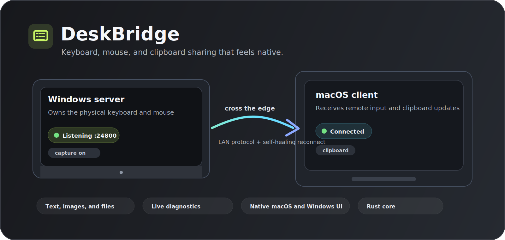
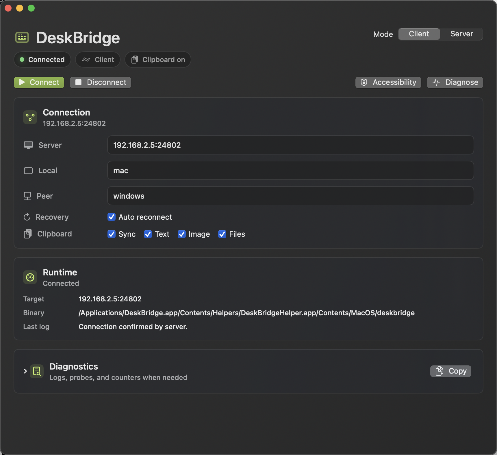

# DeskBridge

<p align="center">
  
</p>

<p align="center">
  <strong>Keyboard, mouse, and clipboard sharing that feels native.</strong>
</p>

<p align="center">
  DeskBridge lets one computer control another across your local network: move through a configured screen edge, keep typing, scroll naturally, and share clipboard text, images, and files.
</p>

<p align="center">
  <a href="README.zh-CN.md">中文</a>
  ·
  <a href="https://github.com/Hades300/deskbridge/releases/latest">Download</a>
  ·
  <a href="docs/MACOS.md">macOS</a>
  ·
  <a href="docs/WINDOWS.md">Windows</a>
  ·
  <a href="docs/ARCHITECTURE.md">Architecture</a>
</p>

<p align="center">
  <a href="https://github.com/Hades300/deskbridge/actions/workflows/ci.yml"></a>
  <a href="https://github.com/Hades300/deskbridge/actions/workflows/release.yml"></a>
  <a href="https://github.com/Hades300/deskbridge/releases/latest"></a>
  <a href="LICENSE"></a>
</p>

## Why DeskBridge?

DeskBridge is for people who keep multiple machines on one desk and want them to behave like one workstation. It is inspired by tools such as Input Leap, Barrier, and Synergy, but it is a clean-room implementation with a different product goal: make reliability, reconnect behavior, diagnostics, and native desktop feel first-class.

The best-tested setup today is:

- Windows owns the physical keyboard and mouse.
- macOS runs as the client.
- Moving across the configured screen edge transfers keyboard and mouse control.
- Clipboard sync follows the active session.
- If the server sleeps, reboots, or restarts, the client reconnects without becoming a mystery process.

DeskBridge is not wire-compatible with Input Leap, Barrier, or Synergy. Run DeskBridge on both machines.

## Screenshot

<p align="center">
  
</p>

## Highlights

- Native-feel macOS status app and Windows WPF admin panel.
- Rust daemon and protocol core with explicit heartbeats, stale-connection detection, and reconnect loops.
- Optional shared-secret encryption: an authenticated, encrypted Noise channel so keystrokes and clipboard never travel in plaintext.
- Zero-config LAN discovery: servers advertise over mDNS so clients can find them without typing an IP.
- Configurable screen layout, including edge-based routing between machines with different display sizes.
- Edge anti-misfire guards: optional dwell delay and corner dead zone to stop accidental screen switches.
- Shared clipboard for text, images, and regular files.
- Remote diagnostics for display info, peer metadata, target logs, server logs, route probes, capture probes, and performance counters.
- Runtime controls for reverse scrolling and remote wheel speed.
- Defensive input cleanup so stuck modifier keys are released when routing changes or sessions end.
- Release packages for macOS, Windows x64, Windows ARM64, and Linux x64.

## Download

Use the latest stable release:

[github.com/Hades300/deskbridge/releases/latest](https://github.com/Hades300/deskbridge/releases/latest)

Release assets:

- `DeskBridge-macos.dmg`
- `DeskBridge-macos.zip`
- `DeskBridge-windows-x64.zip`
- `DeskBridge-windows-arm64.zip`
- `DeskBridge-linux-x64.tar.gz`

The Windows zip contains both the admin app and the command-line daemon. Start with `DeskBridge.Admin.exe`; the admin app launches `deskbridge.exe` for you.

## Quick Start: Windows Controls Mac

1. Install DeskBridge on the Mac.
2. Download and unzip `DeskBridge-windows-x64.zip` on Windows.
3. On Windows, open `DeskBridge.Admin.exe`.
4. Keep the default listen address, for example `0.0.0.0:24800`, then click **Start Server**.
5. Allow the Windows firewall prompt for private networks.
6. On the Mac, open DeskBridge, choose **Client**, and set the server to your Windows LAN address, for example `192.168.2.5:24800`.
7. Set the Mac screen name to `mac` and the Windows peer name to `windows`.
8. Grant macOS Accessibility permission when prompted.
9. Move the Windows pointer through the configured screen edge to enter the Mac.

If the Mac keeps asking for Accessibility permission, make sure permission is granted to the helper process inside `DeskBridge.app/Contents/Helpers/DeskBridgeHelper.app`, not only to a terminal or an older copy of the app.

## Everyday Controls

The app is designed to be useful without reading logs:

- **Mode**: choose Server or Client from the app UI.
- **Connection**: set listen/server address and peer names.
- **Layout**: on the server, drag the peer display to match your physical desk.
- **Clipboard**: enable or disable text, image, and file sync.
- **Recovery**: keep auto reconnect on for laptop sleep, Wi-Fi changes, and server restarts.
- **Diagnostics**: run probes when input or routing does not feel right.

For deeper platform notes, see [docs/MACOS.md](docs/MACOS.md) and [docs/WINDOWS.md](docs/WINDOWS.md).

## CLI

DeskBridge also works as a command-line daemon.

Create a default config:

```bash
deskbridge init-config --path deskbridge.json
```

Run a server:

```bash
deskbridge server --listen 0.0.0.0:24800 --name windows --allow mac --capture
deskbridge server --config examples/deskbridge.json --capture
```

Reduce accidental edge switches by requiring a short dwell at the edge and a corner dead zone:

```bash
deskbridge server --listen 0.0.0.0:24800 --name windows --allow mac --capture \
  --edge-switch-delay-ms 120 --edge-corner-size 40
```

Find servers on the local network without knowing their address:

```bash
deskbridge discover
deskbridge discover --timeout-ms 3000
```

## Encryption

By default the LAN transport is plaintext. Because keystrokes can include
passwords and the clipboard can carry anything, set a shared secret on **both**
machines to upgrade the connection to an authenticated, encrypted channel
(Noise `NNpsk0`: mutual authentication, ChaCha20-Poly1305, and forward secrecy).
A peer without the matching secret cannot connect.

```bash
# Same secret on server and client. Mismatched or missing secrets are rejected.
deskbridge server --listen 0.0.0.0:24800 --name windows --allow mac --capture --psk "your-shared-secret"
deskbridge client --server 192.168.2.5:24800 --name mac --psk "your-shared-secret"
```

The secret can also come from the `DESKBRIDGE_PSK` environment variable or the
`security.psk` field in the JSON config. `diag` and `debug` accept `--psk` too.

Run a client:

```bash
deskbridge client --server 192.168.2.5:24800 --name mac --reconnect
deskbridge client --config examples/deskbridge.json
```

Run diagnostics:

```bash
deskbridge diag --server 192.168.2.5:24800 --name mac
deskbridge version
deskbridge display-info
```

Probe a live route through the server:

```bash
deskbridge debug --server 192.168.2.5:24800 --name mac route-status
deskbridge debug --server 192.168.2.5:24800 --name mac perf
deskbridge debug --server 192.168.2.5:24800 --name mac route-probe --steps 3 --dx 80 --dy -2
deskbridge debug --server 192.168.2.5:24800 --name mac capture-probe --steps 3 --dx 80 --dy -2
```

## Build From Source

Requirements:

- Rust stable
- SwiftPM and Xcode Command Line Tools for the macOS app
- .NET 8 SDK for the Windows admin app

Build and test:

```bash
source "$HOME/.cargo/env"
cargo build --workspace
cargo test --workspace
./scripts/verify-local.sh
```

Package the macOS app locally:

```bash
./scripts/package-macos-app.sh
open build/DeskBridge.app
```

## Architecture

DeskBridge keeps the platform-specific pieces thin:

- `deskbridge-core`: protocol, config, layout routing, health, and simulation.
- `deskbridge-daemon`: server/client runtime, input capture, injection, clipboard, diagnostics, and CLI.
- `apps/macos`: native SwiftUI/AppKit shell that supervises the helper daemon.
- `apps/windows/DeskBridge.Admin`: WPF admin panel for server configuration and lifecycle.

Read more in [docs/ARCHITECTURE.md](docs/ARCHITECTURE.md).

## Current Scope

Stable enough to use and iterate on:

- Windows server to macOS client keyboard/mouse sharing.
- Auto reconnect and stale connection recovery.
- Clipboard sync for text, images, and regular files.
- Server-side layout editing and diagnostics.
- macOS local packaging and Windows zip packaging through GitHub Actions.

Still intentionally limited:

- Directory clipboard transfer and large-file streaming.
- Polished signed installers and notarization.
- Broad validation across every Windows/macOS/Linux display topology.

## License

MIT.
